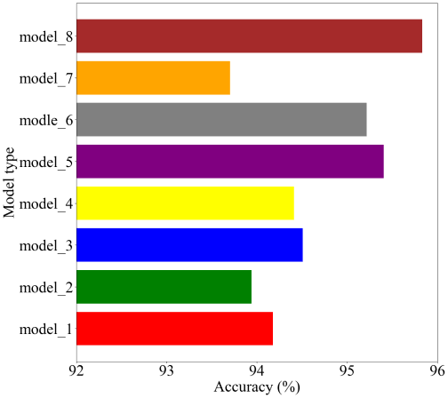
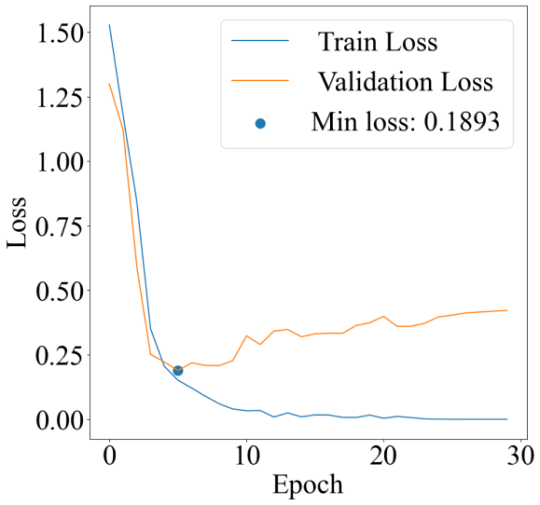
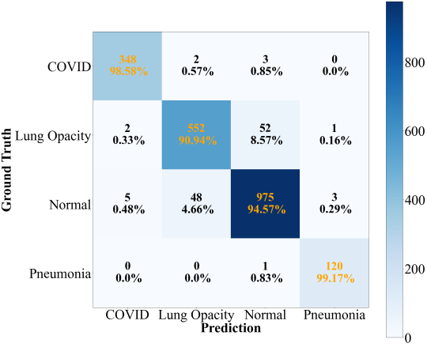

# Machine-Learning-Model-Results-Visualization-and-Evaluation
## Introduction
This repository aims to evaluate the performance of machine learning models by visualizing results with 
1. Accuracy
2. Mathematical metrics: recall/sensitivity (R), precision (P), F1 score (F)
3. Class Activation Map (Heat-map-like): Grad-CAM 
4. ...

As we all know, evaluating the performance of machine learning models is always a pivotal and necessary step in research. 
So I create this repository to handle results from models, mainly for torch and computer vision tasks.
For further fundamental explanation in [my blog](https://tychence.wordpress.com/machine-learning-results-evaluation/).

## Results Display
These are some example graphs from one of my project:

Accuracy comparison between models

Loss graph during training and validaton

Confusion Matrix

