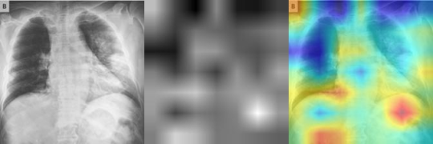

# Machine-Learning-Results-Visualization-and-Evaluation
## Introduction
This repository aims to evaluate the performance of machine learning models by visualizing results with 
1. Accuracy
2. Mathematical metrics: recall/sensitivity (R), precision (P), F1 score (F)
3. Class Activation Map (Heat-map-like): [Grad-CAM](https://github.com/TyBruceChen/Grad-CAM--Understand-deep-learning-from-higher-view) 
4. Calculation of True Positive (TP), TN, FP, FN
5. Draw the confusion matrix
6. ...

repository status: in progress

As we all know, evaluating the performance of machine learning models is always a pivotal and necessary step in research. 
So I create this repository to handle test results from models, mainly aiming for torch and computer vision tasks.
For further fundamental explanation in [my blog](https://tychence.wordpress.com/machine-learning-results-evaluation/).

## Results Display
These are some example graphs from one of my project:

[Accuracy comparison between models](code/bar_graph_gen.py)

[Loss graph during training and validaton](code/Loss_Acc_graph_gen.py)

[Confusion Matrix](code/confusion_matrix_graph_gen.py)

[Recall, Precision, F1 score, and TP TN FP FN](code/metrics_eval.py)

Grad-CAM (critical feactures in model's vision(for classifying lungs in this case))
See the code in my another repository: 

[Grad-CAM-pytorch--Understand-deep-learning-from-higher-view](https://github.com/TyBruceChen/Grad-CAM-pytorch---Understand-deep-learning-from-higher-view)

